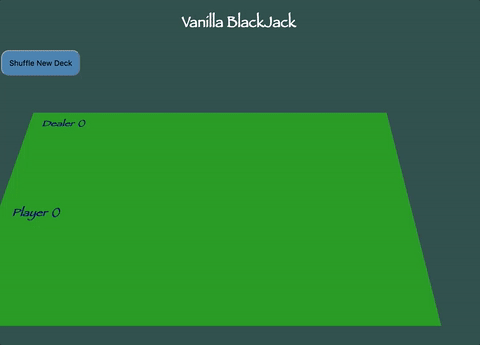
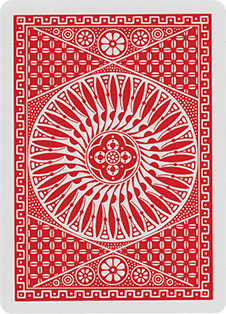

## Project #3:
## Vanilla BlackJack

---
### Introduction
* In this workshop you will be using the elegant [DeckOfCardsApi](http://deckofcardsapi.com/) in order to build your own game of BlackJack.

* Once complete, your game will look something like the picture below, at which point you will be able to customize and skin it to your own liking by adding onto index.html and styles.css.

<p align="center">
  
</p>

* You are provided with 3 files:
  * index.html
  * app.js
  * styles.css

* While index.html and styles.css are sufficiently complete for the basic game of blackjack, app.js is fairly empty - only the function names and state variables are provided for you. You're job is to complete app.js in order to create a functioning game of blackjack.

---
### Getting Starting

Create an `index.html` file with the following content:

```html
<!DOCTYPE html>
<html>
<head>
    <meta charset="utf-8">
    <title>Vanilla BlackJack</title>
    <link rel="stylesheet" type="text/css" href="./styles.css">
</head>
<body>
    <h1>Vanilla BlackJack</h1>
    <button id="new-game">Shuffle New Deck</button>
    <div class="game-container">
        <div id="game-area">
            <div id="dealer-area">
                <h2>Dealer (<span id="dealer-number"></span>)</h2>
                <div id="dealer-cards">
                    <!-- Cards will appear here. -->
                </div>
            </div>
            <div id="player-area">
                <h2>
                    Player (<span id="player-number"></span>)
                    <span id="announcement"></span>
                </h2>
                <div id="player-cards">
                    <!-- Cards will appear here. -->
                </div>
            </div>
        </div>
        <div id="action-area">
            <button id="next-hand" style="display:none;">Next Hand</button>
            <button id="hit-me" style="display:none;">Hit me</button>
            <button id="stay" style="display:none;">I'll stay</button>
        </div>
    </div>
    <script type="text/javascript" src="./app.js"></script>
</body>
</html>
```


Create a `styles.css` with the following content:

```css
body {
  height: 100vh;
  background: DarkSlateGray ;
}

h1 {
  margin: 2rem;
  text-align: center;
  color: white;
  font-family: fantasy;
}

h2 {
  font-family: fantasy;
  font-size: 26px;
  color: Navy;
}

.game-container {
  display: flex;
  flex-flow: row nowrap;
  align-items: center;
  perspective: 1000px;
}

#game-area{
  z-index: 1;
  width: 85%;
  transform: rotateX(35deg);
  padding: 0 2rem 2rem 2rem;
  background: ForestGreen;
}

#dealer-area {
  margin-bottom: 2rem;
}

#dealer-cards {
  transform: translateY(-40px);
  display: flex;
  justify-content: center;
  height: 168px;
}

#player-area #announcement {
  margin-left: 25%;
}

#player-cards {
  display: flex;
  justify-content: center;
  height: 168px;
}

#action-area {
  z-index: 10;
  width: 15%;
  display: flex;
  flex-direction: column;
}

#next-hand, #hit-me {
  margin-bottom: 3rem;
}

button {
  background: SteelBlue;
  padding: 1rem;
  font-size: 1rem;
  border-radius: 1rem;
  outline: none;
}

img {
  width: 130px;
  height: 190px;
}

@media (min-width: 1200px) {
  body {
    padding: 0 12%;
  }
}
```
---
### Testing the Deck-of-Cards API

Visit the [DeckOfCardsApi](http://deckofcardsapi.com/) and familiarize yourself with the first two api calls:
* "Shuffle the cards"
* "Draw a card"

Open a new tab in chrome and open your console in developer tools.
Paste the following into the console in order to observe the parsed response from DeckOfCardsApi.

```javascript
fetch('https://deckofcardsapi.com/api/deck/new/shuffle/?deck_count=6')
.then(response => response.json())
.then(data => console.log(data))
```

Inside the response, find the `deck_id` and replace the value in the following api call in order to draw 4 cards from the deck you just shuffled.

```javascript
fetch('https://deckofcardsapi.com/api/deck/<<deck_id>>/draw/?count=4')
.then(response => response.json())
.then(data => console.log(data))
```
---
### Writing the game logic

Create an `app.js` with the following content:
Instructions are given inside each of the hallowed out functions.
Your job is to fill out these functions to get the game running smoothly.

```javascript
// app state
// ===================
// These variables represent the state of our application, they tell us at
// any given moment the state of our blackjack game. You might find it useful
// to use these to debug issues by console logging them in the functions below.
var deckID = "";
var dealerCards = [];
var playerCards = [];
var playerScore = 0;
var dealerScore = 0;
var roundLost = false;
var roundWon = false;
var roundTied = false;


// game play nodes:
// ===================
// These nodes will be used often to update the UI of the game.

// assign this variable to the DOM node which has id="dealer-number"
var dealerScoreNode

// select the DOM node which has id="player-number"
var playerScoreNode

// select the DOM node which has id="dealer-cards"
var dealerCardsNode

// select the DOM node which has id="player-cards"
var playerCardsNode

// selec the DOM node which has id="announcement"
var announcementNode

// selec the DOM node which has id=new-game"
var newDeckNode

// selec the DOM node which has id="next-hand"
var nextHandNode

// selec the DOM node which has id=""hit-me""
var hitMeNode

// selec the DOM node which has id="stay"
var stayNode


// On click events
// ==================
// These events define the actions to occur when a button is clicked.
// These are provided for you and serve as examples for creating further
// possible actions of your own choosing.
newDeckNode.onclick = getNewDeck;
nextHandNode.onclick = newHand;
hitMeNode.onclick = () => hitMe('player');
stayNode.onclick = () => setTimeout(() => dealerPlays(), 600);
// ==================


// Game mechanics functions
// ========================


function getNewDeck() {
  /* This function needs to:
  1) Call the resetPlayingArea function
  2) Make a call to deckofcardsapi in order to retrieve a new deck_id
  3) Set the value of our state variable deckID to the retrieved deck_id
  4) Change the display property of style on the nextHandNode element in order
  to provide the player with the Next Hand button.
  5) Hide the hit-me and stay buttons by changing their style.display to "none"
  6) Catch any errors that may occur on the fetch and log them */
}

function computeScore(cards) {
  // This function receives an array of cards and returns the total score.
  // ...
}


function newHand() {
  /* This function needs to:
  1) Call the resetPlayingArea function
  2) Make a call to deckofcardsapi using the deckID state variale in order
  to retrieve draw 4 cards from the deck.
  3) Once 4 cards have been drawn, push 2 of them to our dealerCards state
  array and 2 to our playerCards state array.
  4) Set our dealerScore state variable to "?" and then set the textContent
  value of the dealerScoreNode to dealerScore;
  5) ForEach card in playerCards and dealerCards, create an  element
  and assign the src of these to their respective card images. Don't forget to
  append these newly created  elements to the respective #dealer-cards and
  #player-cards DOM elements in order to have them show up in the html.
  6) Finally, compute the player's score by calling computeScore() and update
  the playerScoreNode to reflect this.
  7) If player score is 21, announce immediate victory by setting:
  roundWon = true;
  announcementNode.textContent = "BlackJack! You Win!";
  8) catch and log possible error from the fetch.
  */
}


function resetPlayingArea() {
  /* This function needs to:
  1) Reset all state variables to their defaults
  2) Reset the gameplay UI by updating textContent of all Nodes which may
  be displaying data from a previous round in the game. (ex: dealerScoreNode)
  3) Remove all  elements inside dealerCardsNode and playerCardsNode.
  */
}


function hitMe(target) {
  /* This function needs to:
  1) If any of roundLost or roundWon or roundTied is true, return immediately.
  2) Using the same deckID, fetch to draw 1 card
  3) Depending on wether target is 'player' or 'dealer', push the card to the
  appropriate state array (playerCards or dealerCards).
  4) Create an  and set it's src to the card image and append it to the
  appropriate DOM element for it to appear on the game play UI.
  5) If target === 'player', compute score and immediately announce loss if
  score > 21 by setting:
  roundLost = true;
  and updating announcementNode to display a message delivering the bad news.
  6) If target === 'dealer', just call the dealerPlays() function immediately
  after having appended the  to the game play UI.
  7) Catch error and log....
  */
}

function dealerPlays() {
  /* This function needs to:
  1) If any of roundLost or roundWon or roundTied is true, return immediately.
  2) Compute the dealer's score by calling the computeScore() function and
  update the UI to reflect this.
  */

  if (dealerScore < 17) {
    // a delay here makes for nicer game play because of suspence.
    setTimeout(()=>hitMe('dealer'), 900)
  }
  else if (dealerScore > 21) {
    roundWon = true;
    // ... Update the UI to reflect this...
  }
  else if (dealerScore > playerScore) {
    roundLost = true;
    // ... Update the UI to reflect this...
  }
  else if (dealerScore === playerScore) {
    roundTied = true;
    // ... Update the UI to reflect this...
  }
  else {
    roundWon = true;
    // ... Update the UI to reflect this...
  }

}

```

---
### Hiding the dealer's first card

Now that the game is running smoothly, we need to hide the dealer's first card in order for this to be REAL blackjack. Use this image and modify your app.js to hide the dealer's first card until it is his turn to play.
<p align="center">
  
</p>

---
### Challenge!

Now that your game is running smoothly, here are your options for challenges on this project:
 1. Add betting to the game.
 2. Make the app look professional.
